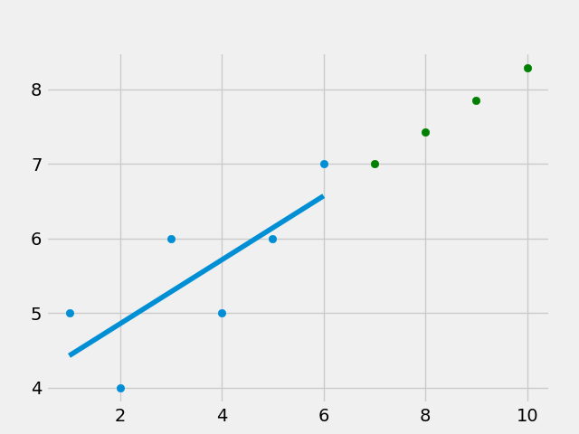
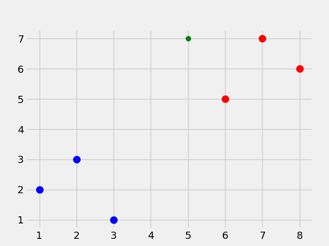
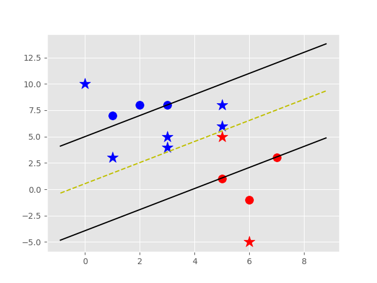
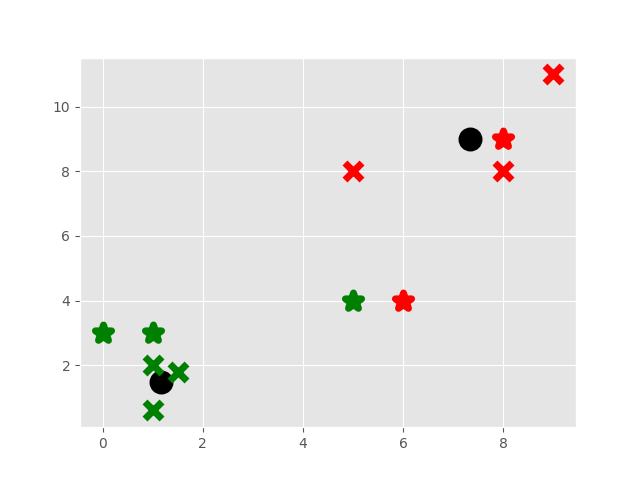
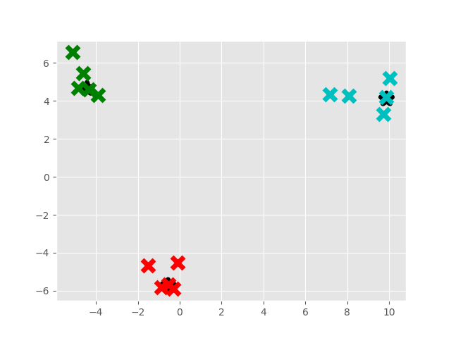

# Machine Learning Tutorial Python Introduction by Sentdex

## Description of This Repository

I followed along with the [Online Machine Learning Tutorial Introduction](https://pythonprogramming.net/machine-learning-tutorial-python-introduction/) by Sentdex. 
This repository contains the coding examples from the course. 

To make the code easier to follow for myself I have re-named variables, moved code blocks, added comments, and added functions. Despite this, the general flow of the course remains the same if you click through the lessons. 

I also made fixes to the coding examples due to libraries deprecating methods and/or renaming things.  

Note: This repository only stores the code. There is a lot more useful information, tips, and tricks mentioned in the actual course videos/notes.  

I hope that this repository can help you decide if you want to take the course for yourself.  

## Overview of the Course by Sentdex

Number of Lessons: 60

Main Algorithms Covered
* Linear Regression
* K Nearest Neighbors
* Support Vector Machines
* K-Means
* Mean Shift
* Neural Networks

Popular Tools Used
* Generic Python
* Numpy, Pandas, Scikit-learn
* Matplotlib
* Tensor Flow

## My Review 

This course is not good for learning theory but it's great for starting to get your hands dirty with code. 

The coding lessons are easy to follow and very cool since you use real datasets and write algorithms from scratch.  
The math and theory is harder to follow for a new person but a great refresher if you're not.   

Before taking this course I think it would be useful to know the following: 
- **Math** if you want to follow along with the Theory (Again, I don't think this is the best place to learn theory)
- The very basic ideas behind ML algorithms that are covered
- The very basics of actually doing Machine Learning (ex: you need training and test datasets; what a model is; etc.)
- Basics of numpy and pandas

The instructor covers a lot of this but I think it would be helpful to have more context going in.

## Introduction

Machine Learning Definition: "field of study that gives computers the ability to learn without explicitly being programmed." - Arthur Samuel 

```
$ pip install -r requirements.txt
```

## Linear Regression

### Lessons: 
* [Lessons 1 and 2](1_2_Regression_IntroAndData.py)
* [Lesson 3](3_Regression_Features_and_Labels.py)
* [Lesson 4](4_Regression_Training_and_Testing.py)
* [Lesson 5](5_Regression_Forecasting_and_Predicting.py)
* [Lesson 6](6_Pickling_and_Scaling.py)
* [Lessons 7, 8, and 9](7_8_9_Regression_Theory_and_Best_Fit_Line.py)
* [Lessons 10 and 11](10_11_Regression_R_Squared_Error.py)
* [Lesson 12](12_Creating_Sample_Data_For_Testing.py)

### Linear Regression Graph


## K Nearest Neighbors

### Lessons: 
* [Lessons 13 and 14](13_14_Classification_K_Nearest_Neighbors.py)
* [Lessons 15, 16, and 17](15_16_17_Classification_KNearest_Neighbors_Euclidean_Distance.py)
* [Lessons 18 and 19](18_19_Testing_Our_K_Nearest_Neighbors.py)

### K Nearest Neighbors Graph


## Support Vector Machines

### Lessons: 
* [Lesson 20, 21, 22, 23, and 24](20_21_22_23_24_Support_Vector_Machine_Intro.py)
* [Lesson 25, 26, 27, and 28](25_26_27_28_SVM_From_Scratch.py)



## K Means

### Lessons: 
* TODO



## Mean Shift

### Lessons: 
* TODO




